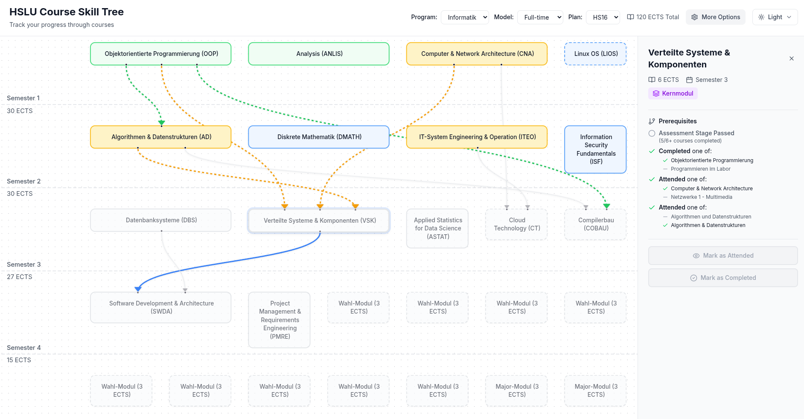

# HSLU Course Skill Tree

Have you ever wanted to register for courses but found it annoying how time consuming it is to check all the requirements for them? With HSLU Skill Tree it takes only a second!

<div align="center">
  <a href="https://jackra1n.github.io/hslu-courses-skill-tree/">
    DEMO
  </a>
</div>



An interactive skill tree visualization tool for university courses. Track your progress through course prerequisites and see which courses become available as you complete the requirements.

> **Disclaimer**: HSLU Courses Skill Tree is not supported by HSLU. It's a private initiative run by students.

## Features

- **Visual Course Graph**: See all courses and their prerequisites in an interactive flow diagram
- **Progress Tracking**: Mark courses as completed, which automatically shows dependent courses as available
- **Smart Status Indicators**: 
  - **Completed** (green): Courses you've finished
  - **Available** (blue): Courses you can take now (prerequisites met)
  - **Locked** (gray): Courses still requiring prerequisites
- **Course Details**: Click any course to view details in the sidebar (ECTS credits, prerequisites)
- **Animated Transitions**: Visual feedback when courses become available
- **Local Storage**: Your progress is automatically saved in your browser
- **Dark/Light Theme**: Switch between themes to match your preference
- **Curriculum Templates**: Pre-configured study plans for different programs

## Getting Started

Install dependencies:

```sh
bun install
```

Start the development server:

```sh
bun run dev --open
```

## Tech Stack

- **Bun**
- **SvelteKit**
- **Svelte 5 and TypeScript**
- **UnoCSS** (Tailwindcss4, icons, webfonts)
- **Iconify icons** (lucide)

## Roadmap

- [ ] **More Templates**: Add curriculum templates for other HSLU programs (Wirtschaftsinformatik, Digital Ideation, etc.)
- [ ] **Expanded Course Database**: Include more courses and detailed prerequisite information
- [ ] **Custom Study Plans**: Allow users to create and save their own personalized curriculum plans
- [ ] **Course Links**: Direct links to HSLU course pages and registration systems
- [ ] **Progress Analytics**: Visualize your academic progress and credit accumulation
