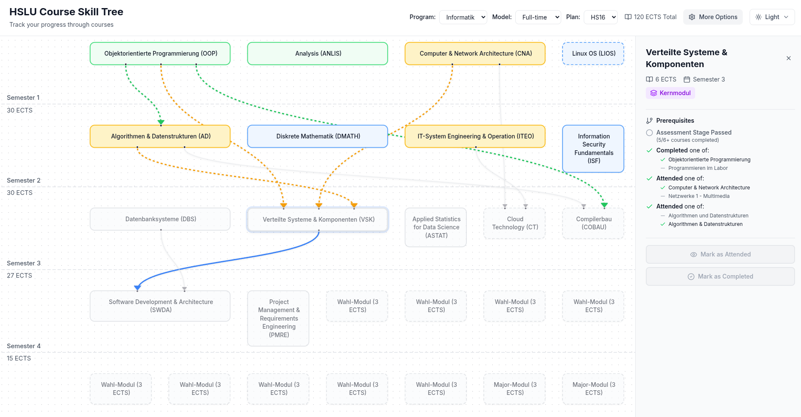

# HSLU Courses Skill Tree

Have you ever wanted to register for courses but found it annoying how time consuming it is to check all the requirements for them? With HSLU Skill Tree it takes only a second!

<div align="center">
  <a href="https://hsluskilltree.com/">
    DEMO
  </a>
</div>



An interactive skill tree visualization tool for university courses. Track your progress through course prerequisites and see which courses become available as you complete the requirements.

> [!WARNING]
> This project is not affiliated with, endorsed by, or supported by HSLU. It's a private initiative run by students.

## Features

- **Visual Course Graph**: See all courses and their prerequisites in an interactive flow diagram
- **Progress Tracking**: Mark courses as completed, which automatically shows dependent courses as available
- **Smart Status Indicators**: 
  - **Completed** (green): Courses you've finished
  - **Available** (blue): Courses you can take now (prerequisites met)
  - **Locked** (gray): Courses still requiring prerequisites
- **Course Details**: Click any course to view details in the sidebar (ECTS credits, prerequisites)
- **Course Browser**: Search and filter all courses, ordered alphabetically by their displayed names in the selected language
- **Animated Transitions**: Visual feedback when courses become available
- **Local Storage**: Your progress is automatically saved in your browser
- **Cloud Sync**: Sign in with GitHub to sync your progress across devices, with conflict resolution when edits overlap
- **Dark/Light Theme**: Switch between themes to match your preference
- **Curriculum Templates**: Pre-configured study plans for different programs

## Roadmap

- [ ] **More Templates**: Add curriculum templates for other HSLU programs (Wirtschaftsinformatik, Digital Ideation, etc.)
- [x] **Expanded Course Database**: Include more courses and detailed prerequisite information
- [x] **Custom Study Plans**: Allow users to create and save their own personalized curriculum plans
- [ ] **Course Links**: Direct links to HSLU course pages and registration systems
- [x] **Progress Analytics**: Visualize your academic progress and credit accumulation
- [x] **Cloud Sync**: Sign in with GitHub to back up and sync your progress across devices
- [x] **Internationalization (i18n)**: English and German interface with a language switcher and bilingual course names

## Tech Stack

- **Bun**
- **SvelteKit**
- **Svelte 5 and TypeScript**
- **UnoCSS** (Tailwindcss4, icons, webfonts)
- **Iconify icons** (lucide)
- **Paraglide JS** (type-safe i18n, compile-time messages)

## Development

From `frontend/`, install dependencies:

```sh
bun install
```

Start the development server:

```sh
bun run dev --open
```

### Tests

Run `bun run web:test` for the frontend unit tests in `test/` and `bun run worker:test` for Worker/D1 integration tests.

For browser tests, install Chromium once, then run the Playwright suite:

```sh
bunx playwright install chromium
bun run e2e:test
```

`e2e:test` builds the production frontend and runs the same user flows on desktop and mobile Chromium. Each test gets a fresh browser context and isolated local D1 storage using Wrangler's test harness, the real Worker, and the real database migrations. No running development server, production credentials, or existing development database is needed. The test-only frontend Worker serves the compiled assets and translates its ephemeral loopback origin to the API's existing development origin; production origin checks stay unchanged.

The suite covers combined filters, prerequisite navigation and focus, keyboard dropdown selection, closed-panel tab order, review CRUD across reloads, guest/other-user controls, and preserving a draft after a failed write. Authenticated cases provision real Better Auth sessions with test users and signed cookies. They do not automate GitHub OAuth; the external login round trip still needs a release smoke check.

Run `bun run e2e:check` to type-check the browser tests. After changing test Worker bindings, regenerate their types with `bun run e2e:types`. CI runs all three test suites and uploads the Playwright HTML report; failed tests include screenshots, traces, and Worker logs. Local reports are in `frontend/playwright-report/` and `frontend/test-results/`.

### Selection controls

Use `frontend/src/lib/components/ui/Dropdown.svelte` for value selections; enable `searchable` for elective-course search. Supply a localized `label` and connect visible labels through `id`. Controls fill their container by default; `width` sets a fixed size, with settings selectors using `9rem`. Menus use the native Popover API to avoid clipping inside scrollable panels. Action menus and informational popovers remain separate components.

### Tutorial

The guided tour uses unmodified Driver.js. In version 1.8.0, its [highlight implementation](https://github.com/nilbuild/driver.js/blob/1.8.0/packages/driver/src/highlight.ts) adds popup-related ARIA attributes to highlighted elements, including noninteractive containers, and removes existing values when leaving a step. This can cause accessibility warnings and affect the exposed state of highlighted controls. We do not carry a local patch or DOM-restoration workaround. Recheck the complete tutorial and accessibility audits when upgrading the dependency.

### Course review API

Migration `0004_course_reviews.sql` adds one review per user/course to D1. All four dimensions are required integers from 1 to 5: `recommendation` and `content_interest` are star ratings; `difficulty` ranges from very easy to very hard, and `workload` from very low to very high. Keep averages separate: high difficulty or workload does not imply poor quality.

Written `text` is optional and stored as an empty string for rating-only reviews. Timestamps use Unix milliseconds. Reviews reference existing users and are deleted with their account; course IDs are validated against the same generated catalog used by the frontend.

The Course Browser detail panel shows reviews without authors' names and separate averages for each dimension. Signed-in users can create, edit, and delete their own review, with keyboard-accessible rating controls and a deletion confirmation. All four ratings must be selected; the optional text is limited to 5,000 characters. Failed saves retain the draft, while switching courses or accounts clears it. The GitHub sign-in callback returns to the selected course. The interface supports English, German, light and dark themes, and mobile layouts.

Recommendation and content-interest averages use five-star displays with partial fills. Difficulty and workload retain their descriptive scales. Each review's ratings are behind an info control supporting hover, keyboard focus, tap, and Escape. Review headers show the date, with an additional label for your own review. The form explains that the name is not shown, but the review remains linked to the account for editing and deletion.

The Course Browser's “Sort by” control orders courses by name A–Z (default), name Z–A, highest review score, or lowest review score. Review score is the average recommendation, not difficulty or workload. Unrated courses stay last in both score directions; equal scores use alphabetical course names. Sorting applies to filtered results and updates when a review is saved or deleted. Individual reviews remain newest first, with no review-sort control.

| Method | Endpoint | Access | Success |
| --- | --- | --- | --- |
| GET | `/api/course-review-scores` | Public | `200 { scores: [{ courseId, recommendation, count }] }` |
| GET | `/api/courses/:courseId/reviews` | Public | `200 { reviews, ownReviewId, summary }` |
| POST | `/api/courses/:courseId/reviews` | Signed in | `201 { review }` |
| PUT | `/api/reviews/:id` | Review owner | `200 { review }` |
| DELETE | `/api/reviews/:id` | Review owner | `204`, empty body |

Encode course IDs with `encodeURIComponent`. Reviews are returned newest first. GET, POST, and PUT review responses do not expose author names, user IDs, email, or session data. GET includes `ownReviewId` for the requesting user's review, or `null` for anonymous visitors and users without a review for that course. Ownership remains enforced server-side. `summary` contains `count` and separate averages for `recommendation`, `contentInterest`, `difficulty`, and `workload`; averages are `null` when no reviews exist. All responses use `Cache-Control: no-store`.

The score endpoint aggregates all reviews in one grouped query and omits unrated courses. If scores cannot be loaded, course-name sorting remains available and score sorting stays disabled without an error notice.

POST and PUT accept exactly this JSON shape; only `text` may be omitted:

```json
{
  "recommendation": 5,
  "contentInterest": 4,
  "difficulty": 2,
  "workload": 3,
  "text": "Useful practical exercises."
}
```

PUT replaces all editable fields; omitting `text` clears it. IDs, authorship, and timestamps are server-controlled. Text is limited to 5,000 UTF-16 code units (`String.length`); the request body is limited to 32,768 bytes.

Writes require an existing Better Auth session cookie and an allowed `Origin`, matching the progress API. Errors: `400` for invalid JSON, fields, ratings, text, or URL encoding; `401` for a missing/invalid session; `403` for a missing/untrusted origin; `404` for an unknown course or a missing/non-owned review; `409` for a duplicate user/course review; `413` for an oversized body; `405` with `Allow` for unsupported methods.

### Translations

UI strings live in `frontend/messages/{en,de}.json` ([Paraglide JS](https://paraglidejs.com) message format). The compiled output in `frontend/src/lib/paraglide/` is gitignored and generated when needed: automatically by `bun run dev` / `bun run build`, and explicitly via `bun run i18n:compile` before `bun run check` / `bun run web:test`. Course names come from the generated catalog, which stores both the German and English module names.

Run `bun run i18n:check` from `frontend/` to verify that all configured catalogs have matching keys and placeholders and that source code only references existing message keys. CI runs this check automatically.
